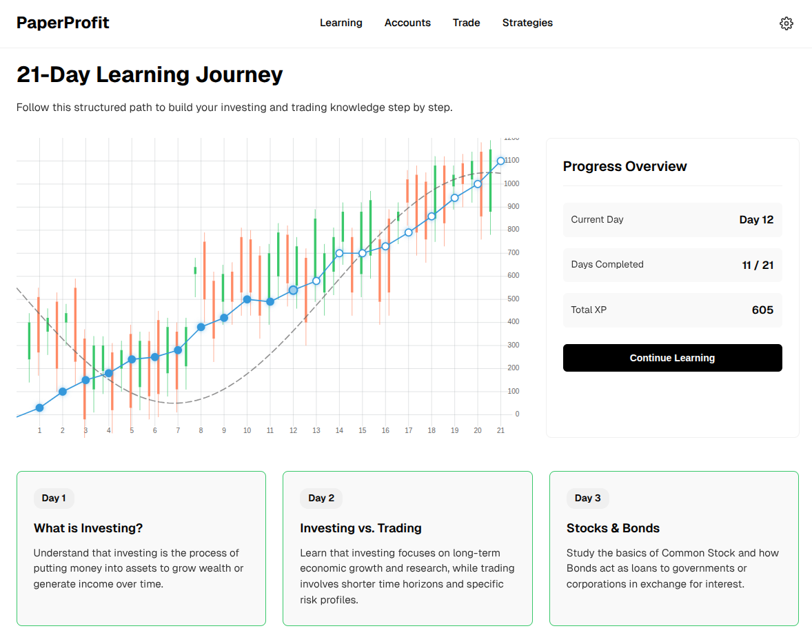

# 📈 PaperProfit

A comprehensive paper-trading platform that lets you learn by doing—teaching you about investing, trading, risk management, markets, portfolio management, and a wide range of investment strategies using real market data, all without risking real money. PaperProfit allows you to simulate trading across multiple strategies, from long-term investing to day trading, with real market data.

Please note that this current version is a MVP and code still has a lots of bugs. 
Also learning journey content is still incomlete.




## 🚀 Features

### Core Functionality
- **21-Day Learning Journey**: Structured educational path with daily lessons, quizzes, and exercises
- **Paper Trading**: Simulate buy/sell orders without real money
- **Portfolio Management**: Track multiple accounts and positions
- **Real Market Data**: Integration with Yahoo Finance, Alpha Vantage, and Financial Modeling Prep
- **Automated Trading Bot**: Background jobs for order processing and strategy execution
- **Performance Analytics**: Track your gains/losses and portfolio performance

### 21-Day Learning Journey
A structured educational program designed to take you from beginner to confident trader in 21 days:

#### Features
- **Daily Lessons**: Each day covers a specific topic with comprehensive study materials and visual aids
- **Interactive Quizzes**: Test your knowledge with multiple-choice quizzes after each lesson
- **Practical Exercises**: Apply what you've learned with hands-on exercises
- **Progress Tracking**: Visual progress tracking with XP system and completion status
- **Sequential Unlocking**: Days unlock as you master previous lessons (requires 80% quiz score to advance)
- **Flexible Learning**: Review completed lessons anytime and retake quizzes

#### Learning Path
The 21-day journey covers essential topics including:
- Market fundamentals and terminology
- Portfolio management principles
- Risk management strategies
- Technical and fundamental analysis
- Trading strategies and execution
- Psychology of trading
- And more...

### 30+ Investment Strategies
PaperProfit includes implementation templates for various trading strategies across multiple categories:

#### Long Term Strategies
- Buy & Hold
- Index Fund Investing
- Dollar-Cost Averaging (DCA)
- Dividend Growth Investing
- Value Investing
- Growth Investing
- Sector Rotation
- Asset Allocation & Rebalancing

#### Swing Trading
- Trend Following
- Breakout Trading
- Momentum Trading
- Mean Reversion
- RSI Overbought/Oversold

#### Day Trading
- Scalping
- VWAP Strategy
- Opening Range Breakout
- News-Based Trading

#### Options Trading
- Covered Calls
- Cash-Secured Puts
- Iron Condor

#### Famous Investor Strategies
- Warren Buffett (Value Investing)
- Ben Graham (Deep Value)
- Peter Lynch (GARP)
- Ray Dalio (All Weather Portfolio)
- Jesse Livermore (Trend & Breakout)
- John Bogle (Passive Index)
- Stanley Druckenmiller (Macro Trend)
- Jim Simons (Quantitative Statistical Arbitrage)

### AI-Powered Analysis
- Stock analysis using AI
- Trading strategy generation
- Market insights and sector analysis
- Multi-stock comparison

## 🛠️ Tech Stack

### Backend
- **Framework**: FastAPI
- **Database**: SQLite with SQLAlchemy ORM
- **Task Scheduling**: APScheduler
- **Market Data**: yfinance, alpha_vantage
- **Python**: 3.x

### Frontend
- **Framework**: Vue 3
- **Build Tool**: Vite
- **UI**: Custom components

## 📋 Prerequisites

- Python 3.8 or higher

## 🔧 Installation

### 1. Clone or download the code
```bash
git clone <repository-url>
cd paper_profit
```

### 2. Run the Application

```bash
./start.sh
```

This will:
- Create and activate a virtual environment
- Install dependencies
- Run database migrations (if needed)
- Start the FastAPI server on port 5000
- Start background jobs for order processing and market data updates

### 3. Open your browser 

Go to http://localhost:5000


### Manual Start

#### Backend API
```bash
cd backend/app
python api.py
```
API will be available at `http://localhost:5000`  
API documentation at `http://localhost:5000/docs`

#### Background Jobs
```bash
cd backend/app
python background.py
```

#### Frontend Development Server
```bash
cd frontend
npm run dev
```
Frontend will be available at `http://localhost:5173`

## 📁 Project Structure

```
paper_profit/
├── backend/
│   ├── app/
│   │   ├── api.py                    # FastAPI application
│   │   ├── main.py                   # CLI entry point
│   │   ├── background.py             # Background job scheduler
│   │   ├── analysis/                 # Technical & fundamental analysis
│   │   ├── config/                   # YAML configuration files
│   │   ├── jobs/                     # Scheduled jobs
│   │   │   ├── trading_bot.py        # Main trading bot logic
│   │   │   ├── process_orders.py     # Order execution
│   │   │   ├── update_market_data.py # Market data updates
│   │   │   └── update_positions.py   # Position updates
│   │   ├── neumann/                  # 21-Day Learning Journey content
│   │   │   └── [1-21]/              # Daily lessons, quizzes, and exercises
│   │   ├── octopus/                  # External service integrations
│   │   │   ├── ai_platforms/         # AI service providers
│   │   │   ├── brokers/              # Broker integrations
│   │   │   └── data_providers/       # Market data providers
│   │   ├── services/                 # Business logic
│   │   ├── storage/                  # Database models & repositories
│   │   ├── tests/                    # Unit tests
│   │   └── utils/                    # Utility functions
│   ├── requirements.txt              # Python dependencies
│   └── PaperProfit.db               # SQLite database
├── frontend/
│   ├── src/
│   │   ├── components/              # Vue components
│   │   │   ├── LearningJourney.vue  # Learning journey dashboard
│   │   │   ├── LearningDetails.vue  # Daily lesson viewer
│   │   │   ├── AssetTrade.vue       # Trading interface
│   │   │   └── ui/
│   │   │       └── LearningStatus.vue # Progress visualization
│   │   ├── App.vue                  # Root component
│   │   └── main.js                  # Entry point
│   ├── package.json                 # Node dependencies
│   └── vite.config.js              # Vite configuration
├── start.sh                         # Quick start script
└── README.md                        # This file
```

## 🔌 API Endpoints

### Accounts
- `GET /api/accounts` - List all accounts
- `POST /api/accounts` - Create new account
- `GET /api/accounts/{id}` - Get account details
- `PUT /api/accounts/{id}` - Update account
- `GET /api/accounts/{id}/summary` - Account summary with positions
- `GET /api/accounts/{id}/portfolio` - Portfolio holdings
- `GET /api/accounts/{id}/performance` - Performance metrics
- `POST /api/accounts/{id}/buy` - Create buy order
- `POST /api/accounts/{id}/sell` - Create sell order

### Strategies
- `GET /api/strategies` - List all strategies
- `POST /api/strategies` - Create new strategy
- `GET /api/strategies/{id}` - Get strategy details
- `PUT /api/strategies/{id}` - Update strategy

### Instruments
- `GET /api/instruments/search?query={q}` - Search for stocks
- `GET /api/instruments/get/{symbol}` - Get instrument details
- `GET /api/instruments/{symbol}/market-data?period={p}` - Historical data

### AI Analysis
- `POST /api/ai/analyze-stock` - AI-powered stock analysis
- `POST /api/ai/generate-strategy` - Generate trading strategy
- `GET /api/ai/market-insights` - Market insights
- `POST /api/ai/compare-stocks` - Compare multiple stocks

### Learning Journey
- `GET /api/learning-days` - Get all learning days
- `GET /api/learning-days/{day}/study` - Get study content for a specific day
- `GET /api/learning-days/{day}/quiz` - Get quiz for a specific day
- `GET /api/learning-days/{day}/exercise` - Get exercise for a specific day
- `GET /api/learning-days/{day}/image` - Get image for a specific day
- `GET /api/settings/learning_journey` - Get learning progress
- `PUT /api/settings/learning_journey` - Update learning progress

### Configuration
- `GET /api/settings` - Get settings
- `POST /api/settings` - Create setting
- `GET /api/service-list` - Get service list
- `GET /api/strategy-list` - Get strategy templates
- `GET /api/guide` - Investment guide

## ⚙️ Configuration

### Strategy Configuration
Edit strategy templates in:
- `backend/app/config/strategy-list.yaml`
- `backend/app/config/strategy-parameters.yaml`

### Service Settings
Configure data providers and services in:
- `backend/app/config/service-list-settings.yaml`

## 📊 Background Jobs

The application runs several scheduled jobs:

1. **Trading Bot** - Executes strategies and generates signals
2. **Process Orders** - Processes pending orders
3. **Update Market Data** - Fetches latest market prices
4. **Update Positions** - Updates position valuations

## 🔐 Database

PaperProfit uses SQLite for simplicity. The database is automatically created and migrated on first run.

### Manual Migration
```bash
cd backend/app
python main.py migrate
```

## 📝 License

This project is for educational purposes. Use at your own risk. Past performance does not guarantee future results.

## ⚠️ Disclaimer

PaperProfit is a **simulation platform** for educational purposes only. It does not execute real trades. Always do your own research and consult with financial advisors before making real investment decisions.

## 🐛 Known Issues

- Market data is delayed (not real-time)
- Some advanced options strategies are templates only
- AI features require API key

## 🗺️ Roadmap

- [ ] More broker integrations
- [ ] Advanced charting and technical indicators
- [ ] Risk management tools

## 📞 Support

For issues, questions, or contributions, please open an issue on GitHub.

---

Made with ❤️ for traders and investors learning the markets.
