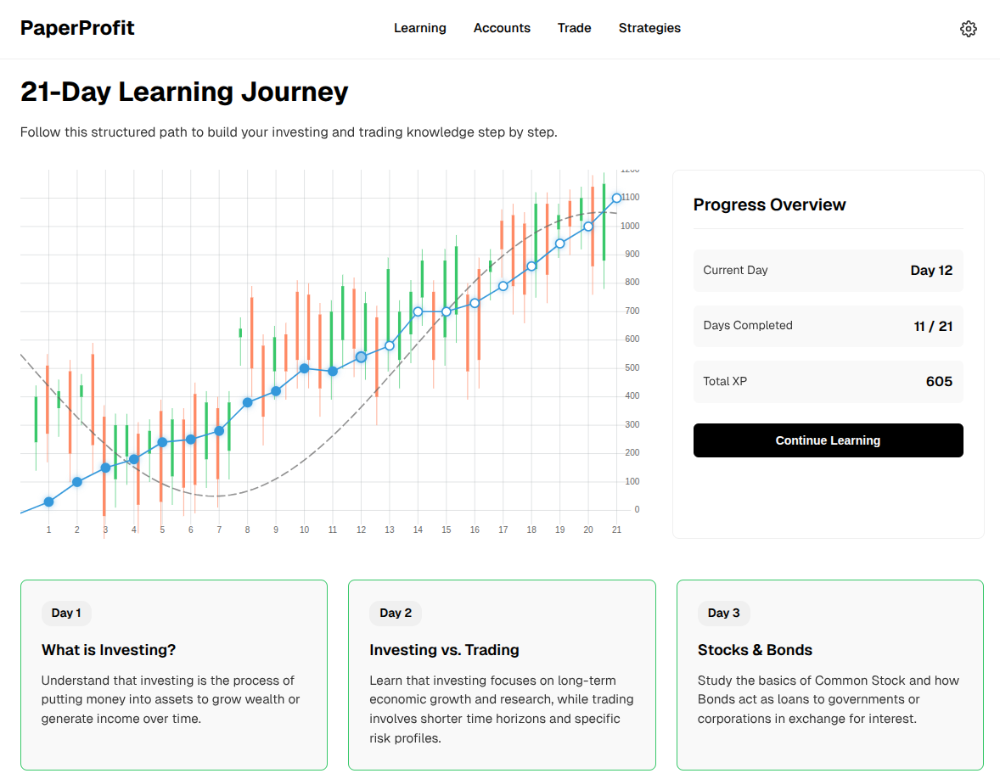
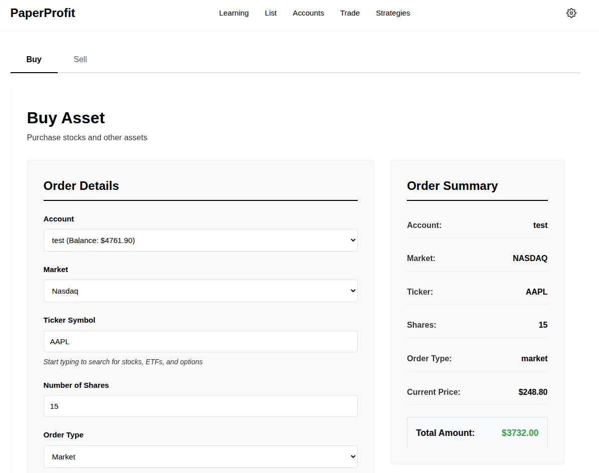
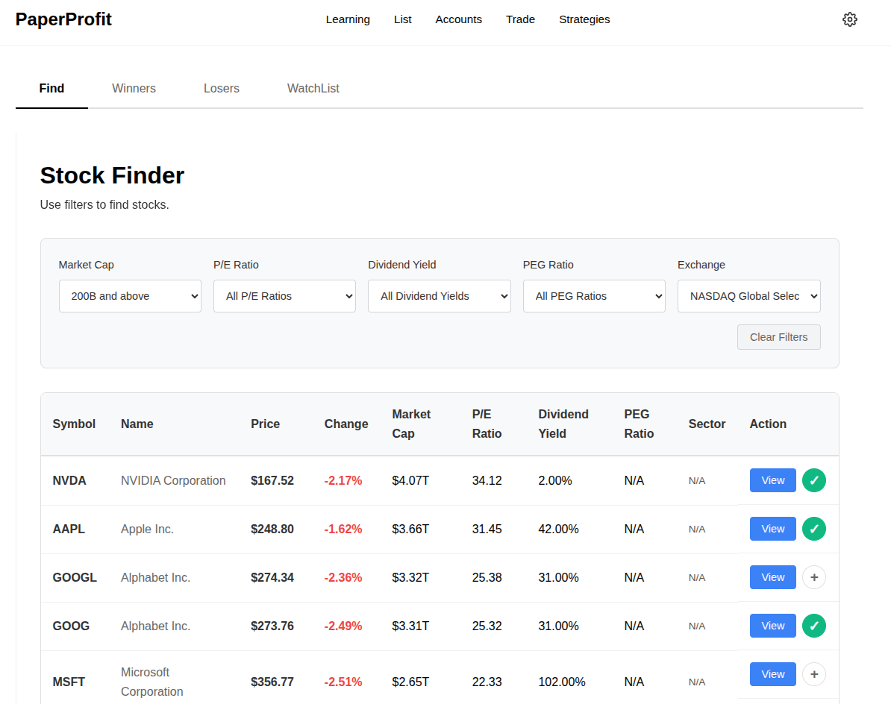
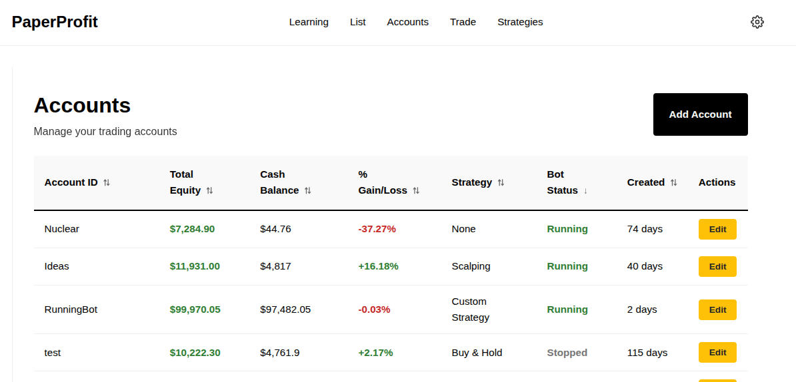

# 📈 PaperProfit

Learn investing and trading by doing. Practice with a virtual account, test real strategies risk-free.
PaperProfit can teach you about investing, trading, risk management, markets, portfolio management, and a wide range of investment strategies using real market data, all without risking real money. 

## 🚀 Features

PaperProfit is packed with the following features:

- **Virtual accounts**: Create multiple virtual accounts which you can use to buy/sell instruments and track your portfolio performance
- **Trade**: Buy/Sell instruments on your virtual accounts
- **Ralph the trading bot**: Runs continuously and handles trading strategy execution. (Named after Ralph Elliott)
- **Warren the investor bot**: Runs once a day and executes long term investment strategy. (Named after Warren Buffett)
- **Octopus**: Octopus is responsible for pulling data from 3rd party services like Yahoo Finance, Alpha Vantage. Also it can connect to AI platforms like OpenAI, Claude
- **Neumann**: A structured educational program designed to take you from beginner to confident trader in 21 days. (Named after Janos Neumann)

### 30+ Investment Strategies
PaperProfit includes implementation templates for various trading strategies across multiple categories:

#### Long Term Strategies
- Buy & Hold
- Index Fund Investing
- Dollar-Cost Averaging (DCA)
- Dividend Growth Investing
- Value Investing
- Growth Investing
- Sector Rotation
- Asset Allocation & Rebalancing

#### Swing Trading
- Trend Following
- Breakout Trading
- Momentum Trading
- Mean Reversion
- RSI Overbought/Oversold

#### Day Trading
- Scalping
- VWAP Strategy
- Opening Range Breakout
- News-Based Trading

#### Options Trading
- Covered Calls
- Cash-Secured Puts
- Iron Condor

#### Famous Investor Strategies
- Warren Buffett (Value Investing)
- Ben Graham (Deep Value)
- Peter Lynch (GARP)
- Ray Dalio (All Weather Portfolio)
- Jesse Livermore (Trend & Breakout)
- John Bogle (Passive Index)
- Stanley Druckenmiller (Macro Trend)
- Jim Simons (Quantitative Statistical Arbitrage)

### AI-Powered Analysis
- Stock analysis using AI
- Trading strategy generation
- Market insights and sector analysis
- Multi-stock comparison

## Screenshot







## 🔧 Installation

### Requirements
- You need Python 3.8 or higher. If it's not installed you need to install python first.

### 1. Clone or download the code
```bash
git clone https://github.com/pg1/paper-profit.git
cd paper-profit
```

### 2. Run the Application

```bash
./start.sh
```

This will:
- Create and activate a virtual environment
- Install dependencies
- Run database migrations (if needed)
- Start the FastAPI server on port 5000
- Start background jobs for order processing and market data updates

### 3. Open your browser 

Go to http://localhost:5000


## 🛠️ Tech Stack

### Backend
- **Framework**: FastAPI
- **Database**: SQLite with SQLAlchemy ORM
- **Task Scheduling**: APScheduler
- **Market Data**: Yahoo Finance, Alpha Vantage
- **Python**: 3.x

### Frontend
- **Framework**: Vue 3
- **Build Tool**: Vite
- **UI**: Custom components


## Disclaimer

PaperProfit is a **simulation platform** for educational purposes only. It does not execute real trades. Always do your own research and consult with financial advisors before making real investment decisions. The author will not be responsible for any misuse of the information provided. All the information is published in good faith and for general information purpose only.